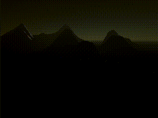

# Mip map fog for Universal Render Pipeline (URP) - Proof of concept

This is a (yet) very simple implementation of mip-map based fog for Unity's Universal Render Pipeline. The shader has built using the Shadergraph. Since the purpose of this is to show a possible fog implementation, the materials features are very basic, i.e. diffuse directional light only.
A reflection probe set to "Realtime" is used as a source for the effect. This should only be updated when the lightsource changes.

The rest is left as an exercise for the reader :-)

The technique is based on the paper by Naughty Dog. Thanks for sharing! 
http://advances.realtimerendering.com/other/2016/naughty_dog/NaughtyDog_TechArt_Final.pdf (starting on page 18)

Limitations:
- reduced material features
- so far, it's linear fog only
- mip-map count for the reflection probe is hard coded to 4

Todo: 
- implement proper _multi_compile_ support for different fog modes

Enjoy.

